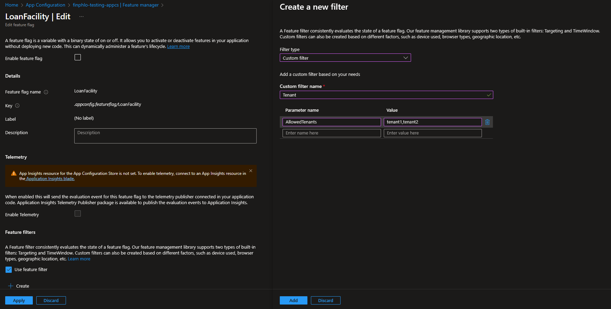

# Feature Flag Management using Azure App Configuration

This repository demonstrates how to implement tenant-based feature flags in ASP.NET Core using Azure App Configuration. Feature flags allow you to enable or disable features for specific tenants without redeploying the application.

## 🚀 Getting Started

Follow these steps to set up and test the feature flag management system:

### 1. Configure Azure App Configuration

1. Create an Azure App Configuration resource in the Azure portal
2. In the Azure App Configuration resource, navigate to "Feature manager"
3. Create a new feature flag:
    - Enable feature flag: Toggle on to enable the feature flag
    - Feature flag name: `LoanFacility`
    - Label: Leave blank
    - Description: (optional) "Controls access to the loan facility feature"
    - Use feature filter: Toggle on
        - Filter type: Custom filter
        - Custom filter name: `Tenant`
        - Filter parameters:
            - Parameter name: `AllowedTenants`
            - Value: `tenant1,tenant4`



### 2. Configure appsettings.{Environment}.json

`appsettings.Development.json` is configured for local development, i.e. it doesn't have a configuration section `Azure:AppConfiguration:Endpoint`.

```json
{
  "FeatureManagement": {
    "LoanFacility": {
      "EnabledFor": [
        {
          "Name": "Tenant",
          "Parameters": {
            "AllowedTenants": ["tenant1", "tenant4"]
          }
        }
      ]
    }
  }
}
```

`appsettings.Testing.json` lacks the `FeatureManagement` section because it's configured for Azure App Configuration.

```json
{
  "Azure": {
    "AppConfiguration": {
      "Endpoint": "https://your-appconfig.azconfig.io"
    }
  }
}
```

### 3. Testing Feature Flags

You can test feature flags by generating JWT tokens with different tenant IDs through the `Identity.Api`:

#### Payload for Allowed Tenant

```json
{
  "userId": "3fa85f64-5717-4562-b3fc-2c963f66afa6",
  "email": "test@example.com",
  "customClaims": {
     "http://schemas.microsoft.com/identity/claims/tenantid": "tenant1"
  }
}
```

#### Payload for Disallowed Tenant

```json
{
  "userId": "3fa85f64-5717-4562-b3fc-2c963f66afa6",
  "email": "test@example.com",
  "customClaims": {
     "http://schemas.microsoft.com/identity/claims/tenantid": "tenant10"
  }
}
```

When you use these tokens to access the `/feature/tenant` endpoint:
- Users with tenant ID "tenant1" or "tenant4" will receive a 200 OK response
- Users with any other tenant ID will receive a 403 Forbidden response

## Adding New Feature Flags

To add a new feature flag:

1. Add a constant in the `FeatureFlags` class:
   ```csharp
   public const string NewFeature = nameof(NewFeature);
   ```

2. Configure the feature flag:
    - In Azure App Configuration -> Feature manager, or
    - In appsettings.Development.json for local development

3. Use the feature flag in your code:
   ```csharp
   if (await featureManager.IsEnabledAsync(FeatureFlags.NewFeature))
   {
       // Feature enabled logic
   }
   else
   {
       // Feature disabled logic
   }
   ```
